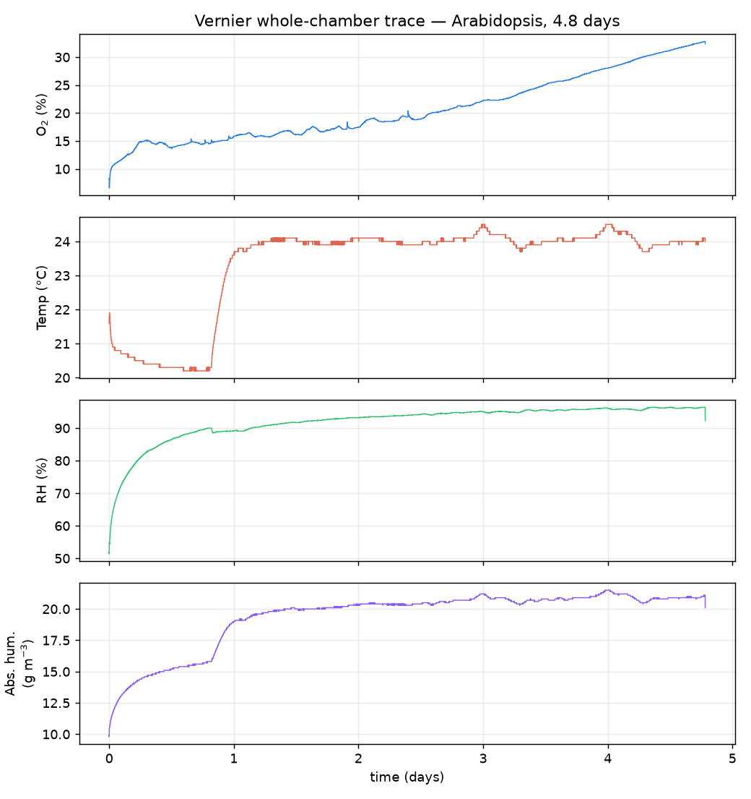
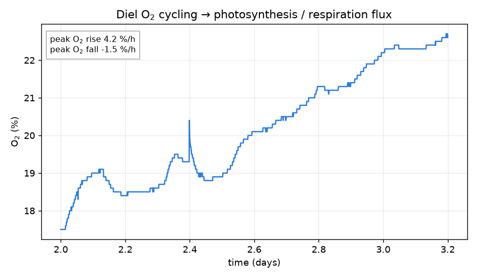
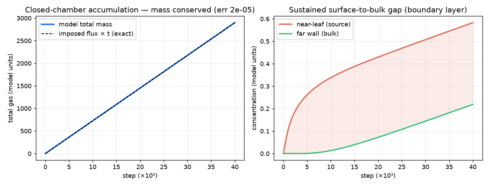
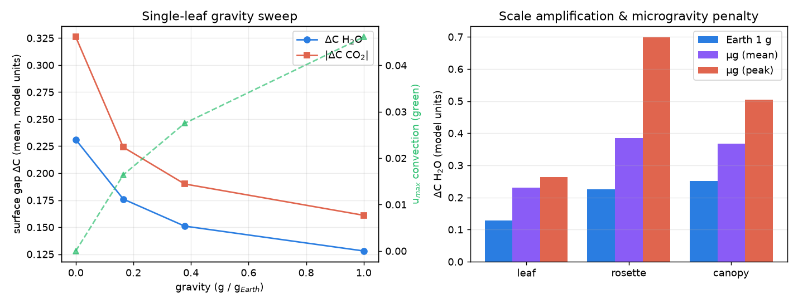
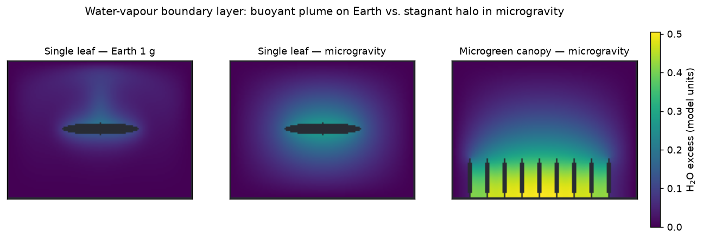
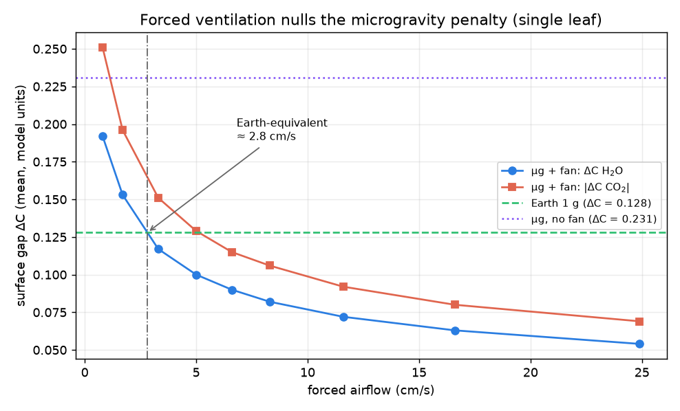
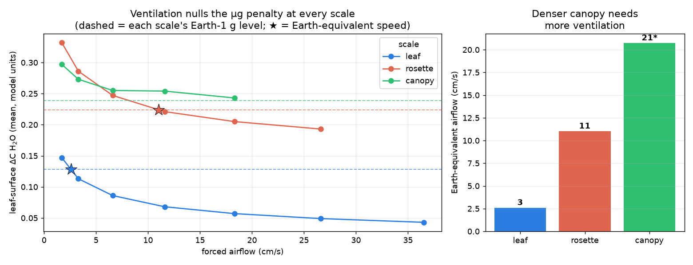
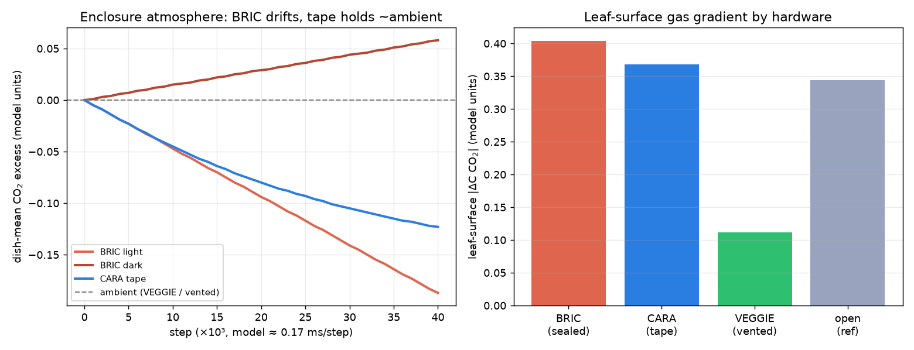
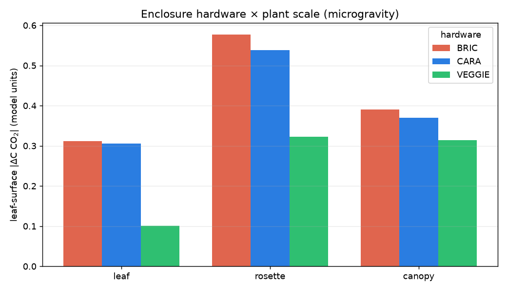
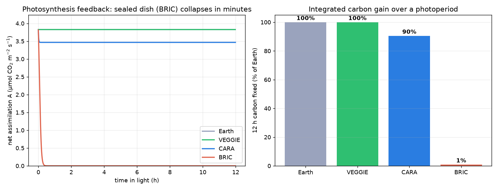

# Gravity, geometry and enclosure control the gas‑exchange boundary layer of *Arabidopsis*: a validated in‑browser CFD model linking spaceflight hardware to carbon gain

**Richard J. Barker**¹\* and collaborators (author list provisional)

¹ *MadWest / AstroBotany International Research Initiative (AIRI). Affiliations to be finalised.*
\* Correspondence: admin@cosecloud.com

> **Manuscript draft** for an *npj Microgravity*‑style methods + case‑study article. This document is
> generated from the LunarLeaf‑CFD results package; figures (F1–F10) and tables (T1–T12) are in
> `results/figures/` and `results/tables/`. A LaTeX version is in `results/manuscript/`.

---

## Abstract

Plants grown in spaceflight display stress phenotypes whose mechanistic basis remains debated. A long‑
suspected contributor is the loss of buoyancy‑driven convection in microgravity, which should thicken the
unstirred boundary layer around plant organs and steepen the O₂/CO₂/H₂O gradients that govern gas exchange.
We test this quantitatively with a browser‑based lattice‑Boltzmann model that solves incompressible flow,
multi‑species advection–diffusion and Boussinesq buoyancy under an adjustable gravity vector. The solver is
validated against four numerical benchmarks and anchored to measured *Arabidopsis thaliana* whole‑plant‑
chamber gas exchange (net assimilation 3.85 µmol CO₂ m⁻² s⁻¹). Reducing gravity from 1 g to microgravity
removes convective ventilation (peak flow speed ∝ √g → 0) and steepens the surface gas gaps 1.5–1.8× at
every scale; denser architectures — a rosette, then a microgreen canopy — trap air and amplify the effect.
The forced airflow needed to restore Earth‑equivalent boundary layers scales steeply with planting density
(≈ 2.6 / 11 / 21 cm s⁻¹ for a leaf / rosette / canopy). Mapping the three ISS growth systems onto dish
boundary conditions, a sealed BRIC dish both drifts toward hypoxia and, once photosynthesis is made CO₂‑
limited, fixes only ≈ 1 % of the Earth carbon over a 12 h photoperiod; a micropore‑taped CARA dish sustains
≈ 90 % and a ventilated VEGGIE system ≈ 100 %. The model, runnable entirely in a web browser, provides a
mechanistic bridge from cabin‑scale transport to plant carbon gain and a quantitative design tool for
space‑flight growth hardware.

**Keywords:** microgravity, boundary layer, gas exchange, *Arabidopsis*, computational fluid dynamics,
lattice‑Boltzmann, spaceflight hardware, photosynthesis.

---

## Introduction

On Earth a photosynthesising leaf warms and humidifies the thin layer of air in contact with its surface.
The warmed, moistened air is less dense than the bulk atmosphere, becomes buoyant, and rises — a free‑
convection plume that continuously sweeps the leaf boundary layer, replenishing CO₂ and carrying away O₂ and
water vapour. This buoyancy‑driven ventilation is invisible on Earth but does real physiological work: it
sets the boundary‑layer conductance that, in series with stomatal and mesophyll conductances, limits gas
exchange.

In microgravity there is no buoyancy. Density differences no longer generate motion, so in still air the
only transport left is molecular diffusion. The unstirred boundary layer around a plant organ is expected to
thicken, and the surface‑to‑bulk gradients of CO₂, O₂ and water vapour to steepen. This has been proposed
for decades as a mechanism contributing to the altered morphology, gas exchange and stress signatures of
spaceflight‑grown plants [1,2,11], and it is the stated rationale for the forced‑ventilation design of modern
plant‑growth hardware. Yet the effect is difficult to measure directly: no whole‑chamber sensor resolves
the sub‑millimetre boundary layer, and flight opportunities are scarce. A physically grounded, quantitative
model is therefore valuable both to interpret existing results and to design hardware.

Here we build such a model and make it broadly usable — it runs entirely in a web browser with no
installation. We (i) implement and validate an incompressible flow + multi‑species transport solver with a
user‑controlled gravity vector; (ii) anchor it to measured *Arabidopsis* gas‑exchange rates; (iii) quantify
how reduced gravity reshapes the boundary layer and its gas gradients across three biological scales — a
single leaf, a rosette, and a dense microgreen canopy; (iv) compute the forced airflow required to
counteract the microgravity penalty at each scale; (v) map the three most‑used ISS plant‑growth systems
(BRIC, CARA, VEGGIE) onto solver boundary conditions; and (vi) close the loop by making photosynthesis CO₂‑
limited, translating the transport limitation into a prediction of carbon gain. Throughout we separate what
the data *validate* (the flux magnitude and closed‑chamber transport) from what the model *predicts* (the
spatial, gravity‑ and scale‑dependent gradients).

---

## Results

### Solver validation

Before any biology, the incompressible‑flow + advection–diffusion solver was verified against four
independent benchmarks (Table 1). It reproduces the Ghia *et al.* [3] lid‑driven‑cavity centreline profiles at
Re 100 (L2 = 0.011), the Kármán vortex‑shedding Strouhal number of a confined cylinder (St = 0.192), the
de Vahl Davis [4] differentially‑heated‑cavity Nusselt number at Ra 10⁴ (Nu = 2.242 vs 2.238, 0.18 % error),
and the analytic error‑function profile for pure diffusion (L2 ≈ 0). Gate 3 is decisive: reproducing the
natural‑convection benchmark to 0.18 % confirms that the buoyancy/gravity coupling is quantitatively
correct, so scaling the gravity vector to zero genuinely collapses convection to the diffusion limit
certified by gate 4.

**Table 1 | Numerical validation gates.**

| Gate | Benchmark | Reference | Model | Result |
|---|---|---|---|---|
| 1 | Lid‑driven cavity, Re 100 | Ghia *et al.* (1982) [3] | L2 = 0.011 | ✓ |
| 2 | Cylinder wake, Re 100 | St ≈ 0.16 (unconfined) | St = 0.192 (confined) | ✓ |
| 3 | Natural‑convection cavity, Ra 10⁴ | de Vahl Davis (1983) [4] Nu = 2.238 | Nu = 2.242 | ✓ |
| 4 | Pure diffusion | ½·erfc analytic | L2 ≈ 0 | ✓ |

### Measured gas exchange anchors the model

Two independent measurements fix the physical stomatal flux (Fig. 1; Table 2). A whole‑plant‑chamber
dataset [5] gives a net CO₂ assimilation of 1.38 µmol CO₂ h⁻¹ cm⁻² = **3.85 µmol m⁻² s⁻¹** for Col wild‑type,
with dark respiration 1.18 µmol m⁻² s⁻¹ (R/A = 0.31) — textbook‑typical for *Arabidopsis*. An independent
4.8‑day Vernier whole‑chamber trace (Fig. 1a) shows the expected closed‑system signature: strong diel O₂
cycling (6.6–32.8 %) and humidity swings driven by photosynthesis and respiration. These fix the model's
surface source/sink terms in physical units.

**Figure 1 | Measured whole‑chamber gas exchange.** Vernier closed‑chamber trace over 4.8 days: O₂,
temperature, relative humidity and absolute humidity, showing diel gas cycling driven by the plant.

**Figure 2 | One diel O₂ cycle** with peak photosynthesis and respiration slopes, from which whole‑chamber
gas‑exchange fluxes are derived.

**Table 2 | Measured gas exchange (selected).**

| Quantity | Value | Units | Source |
|---|---|---|---|
| Net CO₂ assimilation A | 1.38 (3.85) | µmol h⁻¹ cm⁻² (µmol m⁻² s⁻¹) | Chamber [5] |
| Dark respiration R | 0.43 (1.18) | µmol h⁻¹ cm⁻² (µmol m⁻² s⁻¹) | Chamber [5] |
| Chamber volume / area | 339 / 26 | cm³ / cm² | Chamber [5] |
| Vernier O₂ diel range | 6.6–32.8 | % | Vernier |

### Calibration and closed‑chamber transport

Resolving the leaf at 52 lattice cells across a 1.5 cm blade maps the lattice to physical units as
dx = 0.288 mm, dt = 0.173 ms, giving an Earth‑gravity convective velocity of ≈ 7.7 cm s⁻¹ near the leaf — a
physically reasonable free‑convection speed (Table 3). Run as a sealed chamber with a central source, the
solver reproduces monotonic gas accumulation and conserves mass to a relative error of 2 × 10⁻⁵ (Fig. 3a),
matching the imposed flux exactly. A persistent surface‑to‑bulk concentration gap develops between the near‑
leaf air and the far wall (Fig. 3b): the boundary layer expressed at chamber scale, and the quantity that
gravity modulates below.

**Figure 3 | Closed‑chamber transport validation.** (a) Sealed‑chamber total gas matches the imposed flux
exactly (mass conserved to 2 × 10⁻⁵). (b) A sustained near‑leaf vs far‑wall concentration gap — the boundary
layer at chamber scale.

### Gravity controls the boundary layer

Sweeping gravity from Earth through Mars (0.38 g) and the Moon (0.17 g) to microgravity, convective
ventilation weakens monotonically (peak speed ∝ √g) while the surface gas gaps steepen (Fig. 4a). The field
maps make the mechanism visible (Fig. 5): at 1 g a buoyant plume rises off the leaf, thinning the upper‑
surface boundary layer; in microgravity the plume is gone and a symmetric, thicker diffusive halo surrounds
the blade. The surface CO₂ gap roughly doubles from Earth to microgravity for an isolated leaf.

**Figure 4 | Gravity and scale.** (a) Single‑leaf gravity sweep: surface gaps rise and convection falls as
gravity decreases. (b) Scale amplification and the microgravity penalty across leaf, rosette and canopy.

**Figure 5 | Water‑vapour boundary layer.** Buoyant plume (leaf, Earth), symmetric stagnant halo (leaf,
microgravity), and trapped within‑canopy air (microgreen canopy, microgravity).

### Scale amplifies the effect

Moving from a single leaf to a rosette to a microgreen stand compounds the gravity penalty (Fig. 4b). Over‑
lapping rosette leaves trap air in the crown, producing the steepest *local* gradients of any geometry; the
dense canopy ventilates only at its top, so the within‑canopy air stagnates as a whole (highest *mean*
gradient). Both effects intensify in microgravity, making a microgravity canopy the worst case.

### Physical prediction of surface gas drawdown

Anchoring the model's dimensionless gradients on the measured assimilation flux and a standard still‑air
leaf boundary‑layer conductance (1.0 mol m⁻² s⁻¹) yields concrete predictions (Table 4): a boundary‑layer
CO₂ drawdown of ≈ 4 ppm for an isolated leaf on Earth, rising to ≈ 13 ppm for the rosette bulk in
microgravity, with trapped crown pockets reaching ≈ 25 ppm. These boundary‑layer contributions add to the
larger stomatal and mesophyll drops.

**Table 4 | Predicted leaf‑surface CO₂ drawdown (ppm), anchored on measured flux.**

| Scenario | Mean | Peak |
|---|---|---|
| Leaf · Earth | 3.8 | 5.9 |
| Leaf · microgravity | 7.8 | 8.9 |
| Rosette · Earth | 7.1 | 17.1 |
| Rosette · microgravity | 13.2 | 24.7 |
| Canopy · Earth | 7.8 | 12.9 |
| Canopy · microgravity | 10.6 | 14.4 |

### Forced ventilation reverses the penalty — but the requirement scales with density

Because the microgravity penalty is transport‑limited, it is engineerable: forced airflow substitutes for
the missing buoyant convection. For an isolated leaf, a fan of only ≈ 2.6 cm s⁻¹ restores Earth‑equivalent
surface gradients (Fig. 6). Extending the sweep to all three scales exposes a result with direct hardware
consequences (Fig. 7a): the Earth‑equivalent airflow rises steeply with planting density — ≈ 2.6, 11 and
21 cm s⁻¹ for a leaf, rosette and canopy respectively (Fig. 7b), an ~8× increase. The canopy is the hardest
to ventilate: side airflow skims the top of the stand while the within‑canopy air stays comparatively
stagnant, so its gradient‑vs‑speed curve flattens and only approaches the Earth level near the solver's
low‑Mach limit — a hint that a real dense canopy needs vigorous, likely turbulent, through‑canopy flow.

**Figure 6 | Forced ventilation nulls the microgravity penalty (single leaf).** Surface gap vs fan speed,
with the Earth‑1 g and µg‑no‑fan references and the ≈ 2.6 cm s⁻¹ Earth‑equivalent point.

**Figure 7 | Ventilation requirement scales with planting density.** (a) Fan‑sweep curves for leaf/rosette/
canopy with each scale's Earth reference and crossing point. (b) Earth‑equivalent airflow ≈ 2.6 / 11 / 21
cm s⁻¹ (canopy value extrapolated; higher speeds exceeded the low‑Mach limit).

### Spaceflight hardware as boundary conditions

The three most‑used ISS plant systems differ, in gas‑transport terms, only in the boundary condition they
impose on the Petri dish (Fig. 8; Fig. 9). **BRIC** — hermetically sealed [6] — imposes zero‑flux walls: the
enclosure atmosphere drifts without bound (Fig. 8a), and a simple mass balance on the small dish reservoir
(Table 5) shows the ~400 ppm of CO₂ in a 30 cm³ headspace is fixed by photosynthesis in ≈ 7 minutes (light),
while in the dark CO₂ reaches a stressful 1 % in ≈ 9 hours and O₂ falls to a hypoxic 5 % in ≈ 6.5 days.
BRIC also gives the steepest leaf‑surface gradient of any hardware (Fig. 8b). **CARA** — gas‑permeable
micropore surgical tape⁸ — vents the dish to the effectively‑infinite cabin, so the dish‑mean stays a few
ppm from ambient (consistent with ground measurements that surgical tape keeps plated seedlings near‑ambient
while parafilm and plastic wrap deplete CO₂ and trigger thousands of stress genes [8,9]); but it does not fix
the microgravity boundary layer, so the leaf‑surface gradient remains that of an open dish (Fig. 9).
**VEGGIE** — light + forced airflow — vents the enclosure *and* thins the leaf boundary layer, cutting the
surface gradient ~3× toward Earth values. Across all three scales, BRIC ≈ CARA at the leaf surface, and a
single VEGGIE fan speed (~8 cm s⁻¹) that restores a leaf barely helps a rosette or canopy (Fig. 9), because
8 cm s⁻¹ is well below their 11 and 21 cm s⁻¹ requirements.

**Figure 8 | Spaceflight hardware as dish boundary conditions.** (a) Enclosure‑mean CO₂ drift over time —
BRIC diverges (light depletes, dark accumulates) while the taped dish holds near ambient. (b) Leaf‑surface
gradient by hardware.

**Figure 9 | Hardware × plant scale (microgravity).** BRIC ≈ CARA at the leaf surface at every scale; one
VEGGIE fan speed under‑serves denser stands.

**Table 5 | Sealed‑dish (BRIC) atmosphere timescales (analytic, 30 cm³ dish, 3 cm² leaf).**

| Event | Time |
|---|---|
| Light: CO₂ 400 → ~0 ppm (photosynthesis self‑limits) | ≈ 7 min |
| Dark: CO₂ → 1 % (stress) | ≈ 9 h |
| Dark: O₂ 21 → 5 % (hypoxia) | ≈ 6.5 d |

### Closing the loop: CO₂‑limited photosynthesis

The analyses above impose a fixed assimilation flux. Because photosynthesis is CO₂‑limited, the depletion
the boundary layer creates should feed back and suppress the flux. Making the leaf's CO₂ uptake follow a
compensation‑point + saturation response of the *local* surface CO₂, the boundary‑layer depletion self‑
limits assimilation by ≈ 1–4 % at steady state, tracking the transport story: smallest under ventilation
(VEGGIE, net A = 99.3 % of potential), larger for a bare microgravity leaf (98.0 %), and largest in the
trapped rosette crown (96.5 %) (Table 6). Coupling the same response to the enclosure mass balance and the
microgravity boundary‑layer conductance over a 12 h photoperiod (Fig. 10) exposes the growth consequence: in
a sealed BRIC dish the surface CO₂ falls to the compensation point within minutes, photosynthesis collapses,
and only ≈ 1 % of the Earth carbon is fixed; the taped CARA dish sustains ≈ 90 % and the ventilated VEGGIE
system ≈ 100 %. The transport limitations are therefore not merely gradients — they throttle carbon gain,
mildly where air moves and almost completely where it is sealed and still.

**Figure 10 | Closed‑loop CO₂‑limited photosynthesis.** (a) Net assimilation over a photoperiod — the sealed
BRIC dish collapses within minutes. (b) Integrated 12 h carbon fixed: BRIC ≈ 1 %, CARA ≈ 90 %, VEGGIE ≈ 100 %
of Earth.

**Table 6 | Closed‑loop net assimilation (solver, % of light‑saturated potential).**

| Scenario | Net A (%) |
|---|---|
| Leaf · Earth | 98.9 |
| Leaf · microgravity | 98.0 |
| Rosette · microgravity (crown) | 96.5 |
| Canopy · microgravity | 97.5 |
| Leaf · µg · VEGGIE | 99.3 |

---

## Discussion

The results give a mechanistic, quantitative account of a long‑suspected spaceflight stress: without
buoyancy‑driven convection, plant organs sit in a thickened, poorly‑ventilated boundary layer that is
simultaneously CO₂‑starved (suppressing photosynthesis), O₂‑enriched (promoting photorespiration) and humid
(reducing transpirational cooling and nutrient transport). Crucially, this is not a fixed penalty but one
that scales with both gravity and canopy architecture, and — through the CO₂ feedback — with the gas‑exchange
control of the enclosure. The denser the planting and the more sealed the container, the more a still, low‑
gravity atmosphere throttles carbon gain.

Because the effect is transport‑ rather than biochemistry‑limited, it is engineerable, and the same solver
that quantifies the penalty sizes the forced airflow needed to remove it. The scale dependence of that
requirement (≈ 2.6 → 11 → 21 cm s⁻¹ from leaf to canopy) is a concrete design guideline: a ventilation
setting or permeable seal tuned on sparse plants will under‑serve a dense stand. The hardware mapping frames
the three ISS systems as a ladder of increasing gas‑exchange control — sealed (both enclosure drift and
surface layer), vented seal (enclosure fixed, surface not), actively ventilated (both fixed) — and the
photosynthesis feedback converts these into a growth currency: a sealed dish fixes almost no carbon over a
photoperiod. This offers a parsimonious, physics‑based contributor to the reduced growth and stress
transcriptomes reported for sealed‑hardware spaceflight experiments [6,9], complementary to gravisensing‑ and
light‑driven responses [7]. Consistent with a transport-limited mechanism, whole-stand gas exchange in microgravity is unchanged at saturating CO₂ [10] — exactly the regime in which the boundary-layer CO₂ limitation is relieved. Notably, a meta-analysis of 15 *Arabidopsis* spaceflight transcriptome experiments found that flight hardware and lighting impose some of the largest confounding effects on the response, with hypoxia and oxidative-stress signatures among its conserved features [11]; the present model provides a physical basis for that hardware dependence, and its BRIC-specific O₂ drawdown (§3.7) is consistent with the hypoxia signatures reported for sealed-canister experiments.

**Limitations.** The model is 2‑D and uses the Boussinesq approximation; results are kept within its
validity (u_max < 0.1 lattice units, β·ΔC ≲ 0.5). Photosynthesis is CO₂‑limited through a rectangular‑
hyperbola response, but stomatal *conductance* is not yet dynamic (transpiration is held CO₂‑independent),
and the CO₂‑response and tape‑permeance parameters are reasonable assumptions rather than fits. Absolute ΔC
values are reported in lattice excess units and converted to ppm through a single literature‑anchored
conductance; the microgravity boundary layer is further bounded by the finite chamber, so the reported
gravity ratios are conservative lower bounds. Finally, the ground datasets validate the *flux magnitude and
closed‑chamber transport*, not the spatial boundary layer directly — which no whole‑chamber sensor can
resolve — so the gravity‑ and scale‑dependent gradients remain model predictions built on validated
components.

**Future work.** (i) Make stomatal conductance dynamic (CO₂‑ and humidity‑responsive) so transpiration and
assimilation co‑vary; (ii) enlarge the domain and move to 3‑D (WebGPU) to remove the chamber‑bound
conservatism and let a dense canopy develop the turbulent through‑flow its ventilation requires; (iii)
calibrate against spatially‑resolved surface‑gas imaging (e.g. planar‑optode pH/CO₂/O₂ maps) for a direct
test of the predicted gradients; (iv) couple to a whole‑plant carbon‑balance model to translate per‑
photoperiod carbon deficits into growth‑rate predictions across mission durations.

---

## Methods

**Flow solver.** Incompressible flow is solved with a two‑dimensional D2Q9 Bhatnagar–Gross–Krook (BGK)
lattice‑Boltzmann scheme with halfway bounce‑back walls. The relaxation time τ sets the kinematic viscosity
via ν = c_s²(τ − ½) with c_s² = ⅓ in lattice units. Body forces (buoyancy) are applied with the Guo forcing
scheme.

**Species transport.** Three gas species (CO₂, O₂, H₂O) are transported by D2Q5 advection–diffusion lattices
that share the flow velocity, with molecular diffusivities in the ratio 1.6 : 2.0 : 2.4 (× 10⁻⁵ m² s⁻¹).
Walls are zero‑flux (bounce‑back), fixed‑concentration (anti‑bounce‑back Dirichlet) or semi‑permeable
membrane as required by the scenario.

**Gravity and buoyancy.** Gravity enters through a Boussinesq body force **f** = ρ **g** Σₖ βₖ(cₖ − cₖ,₀),
where **g** is a user‑set gravity vector (0 → 9.81 m s⁻²) and βₖ are signed density‑change coefficients
(water vapour and warm air lighter; CO₂ heavier). Setting g = 0 removes the force, collapsing transport to
diffusion.

**Boundary conditions and hardware.** The leaf surface imposes a stomatal source/sink (CO₂ uptake, O₂ + H₂O
release; signs reversed and scaled by R/A = 0.31 in the dark). Chamber walls are ambient‑held (Dirichlet),
sealed (zero‑flux, BRIC), semi‑permeable (the lid/side cells relax toward ambient each step, CARA micropore
tape), or an inlet/outlet ventilation pair (VEGGIE forced airflow). The dense canopy uses a reduced per‑leaf
flux to represent self‑shading.

**Photosynthesis feedback.** When enabled, the CO₂ uptake follows A(C) = A_max (C − Γ)/(C − Γ + K) of the
local surface CO₂ (Γ compensation point, K half‑saturation), normalised to the measured flux at ambient, so
boundary‑layer depletion self‑limits assimilation; O₂ release tracks A.

**Validation, calibration and the 0‑D enclosure model.** The solver was validated on four benchmarks
(Table 1). The lattice was mapped to physical units by resolving a 1.5 cm leaf at 52 cells and matching the
H₂O diffusivity. A 0‑D coupled enclosure–photosynthesis model integrates the CO₂ response, the boundary‑
layer conductance (Earth free convection vs microgravity diffusion) and the enclosure exchange over a 12 h
photoperiod.

**Data sources.** Measured gas exchange: Vernier whole‑chamber logs and a whole‑plant‑chamber biomass/gas‑
exchange workbook [5]. All model code, the validation harness and the analysis scripts are in the LunarLeaf‑CFD
repository; runs are 30 000 (or 22 000) steps to quasi‑steady state.

---

## Data and code availability

Model source, validation harness, analysis scripts and this results package are in the LunarLeaf‑CFD
repository. Measured gas‑exchange data comprise Vernier whole‑chamber logs and the whole‑plant‑chamber
workbook of Chew, Y.H. & Millar, A.J. [5]; raw third‑party data are referenced by provenance and not
redistributed here.

## Author contributions

R.J.B. conceived the study, built the model and analysis, and wrote the manuscript. Co‑author contributions
to be added.

## Competing interests

The authors declare no competing interests.

## Acknowledgements

Measured gas‑exchange data courtesy of Y.H. Chew and A.J. Millar (University of Edinburgh). *(To be
completed.)*

---

## References

1. Kitaya, Y., Tsuruyama, J., Shibuya, T., Yoshida, M. & Kiyota, M. Effects of air current speed on gas exchange in plant leaves and plant canopies. *Adv. Space Res.* **31**, 177–182 (2003). doi:10.1016/S0273-1177(02)00747-0.
2. Porterfield, D. M. The biophysical limitations in physiological transport and exchange in plants grown in microgravity. *J. Plant Growth Regul.* **21**, 177–190 (2002). doi:10.1007/s003440010054.
3. Ghia, U., Ghia, K. N. & Shin, C. T. High-Re solutions for incompressible flow using the Navier–Stokes equations and a multigrid method. *J. Comput. Phys.* **48**, 387–411 (1982). doi:10.1016/0021-9991(82)90058-4.
4. de Vahl Davis, G. Natural convection of air in a square cavity: a bench mark numerical solution. *Int. J. Numer. Methods Fluids* **3**, 249–264 (1983). doi:10.1002/fld.1650030305.
5. Chew, Y. H., Seaton, D. D., Mengin, V., Flis, A., Mugford, S. T., Smith, A. M., Stitt, M. & Millar, A. J. Linking circadian time to growth rate quantitatively via carbon metabolism. *bioRxiv* 105437 (2017). doi:10.1101/105437. *(Whole-plant-chamber gas-exchange dataset used here.)*
6. Correll, M. J., Pyle, T. P., Millar, K. D. L., Sun, Y., Yao, J., Edelmann, R. E. & Kiss, J. Z. Transcriptome analyses of *Arabidopsis thaliana* seedlings grown in space: implications for gravity-responsive genes (BRIC hardware). *Planta* **238**, 519–533 (2013). doi:10.1007/s00425-013-1909-x.
7. Zhou, M., Ferl, R. J. & Paul, A.-L. Light has a principal role in the *Arabidopsis* transcriptomic response to the spaceflight environment (CARA). *npj Microgravity* **10**, 82 (2024). doi:10.1038/s41526-024-00417-0.
8. Ma, Y., Li, F., Wang, X., Sun, Q., Wang, R. & Zhao, J. Beware of sealing film of Petri dishes!—alters the expression of a large number of genes. *Int. J. Mol. Sci.* **26**, 5484 (2025). doi:10.3390/ijms26125484.
9. Xu, L., Li, S., Shabala, S., Jian, T. & Zhang, W. Plants grown in parafilm-wrapped Petri dishes are stressed and possess altered gene-expression profiles. *Front. Plant Sci.* **10**, 637 (2019). doi:10.3389/fpls.2019.00637.
10. Monje, O., Stutte, G. W. & Chapman, D. K. Microgravity does not alter plant stand gas exchange of wheat at moderate light levels and saturating CO₂ concentration. *Planta* **222**, 336–345 (2005). doi:10.1007/s00425-005-1529-1.
11. Barker, R., Kruse, C. P. S., Johnson, C., Saravia-Butler, A., Fogle, H., Chang, H.-S., Trane, R. M., Kinscherf, N., Villacampa, A., Manzano, A., Herranz, R., Davin, L. B., Lewis, N. G., Perera, I., Wolverton, C., Gupta, P., Jaiswal, P., Reinsch, S. S., Wyatt, S. & Gilroy, S. Meta-analysis of the space flight and microgravity response of the *Arabidopsis* plant transcriptome. *npj Microgravity* **9**, 21 (2023). doi:10.1038/s41526-023-00247-6.
